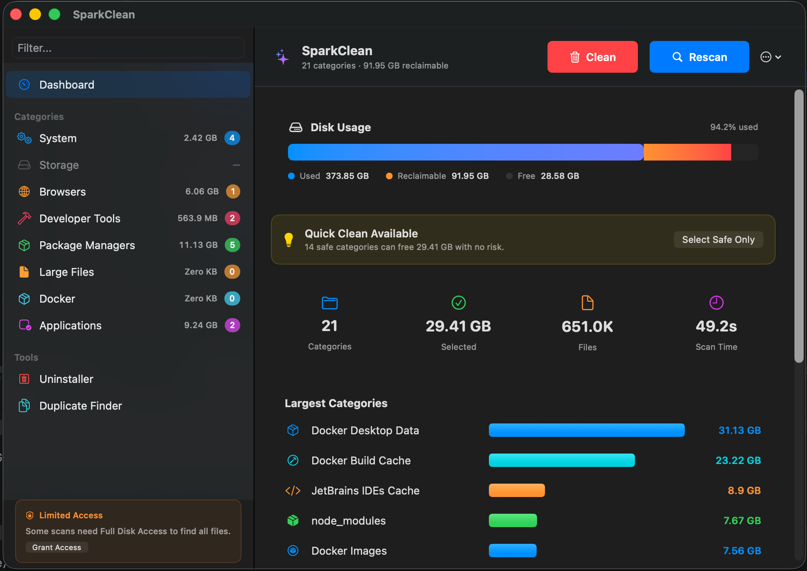
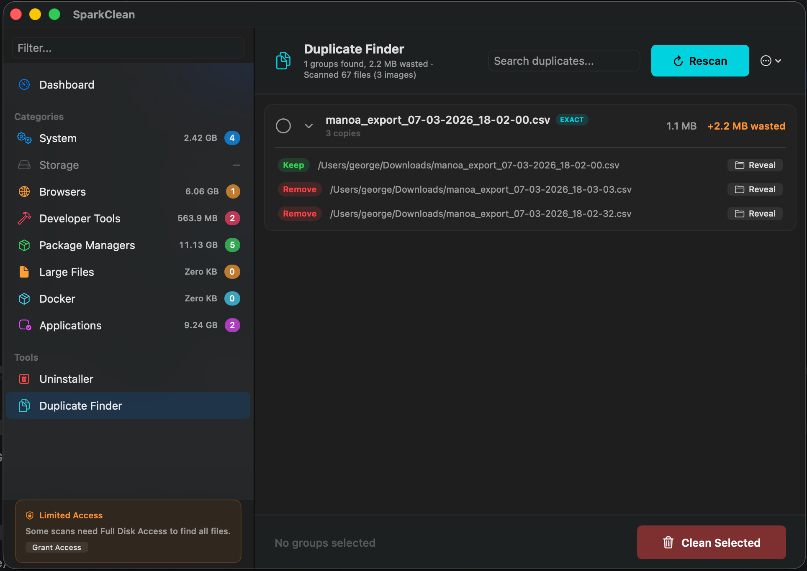
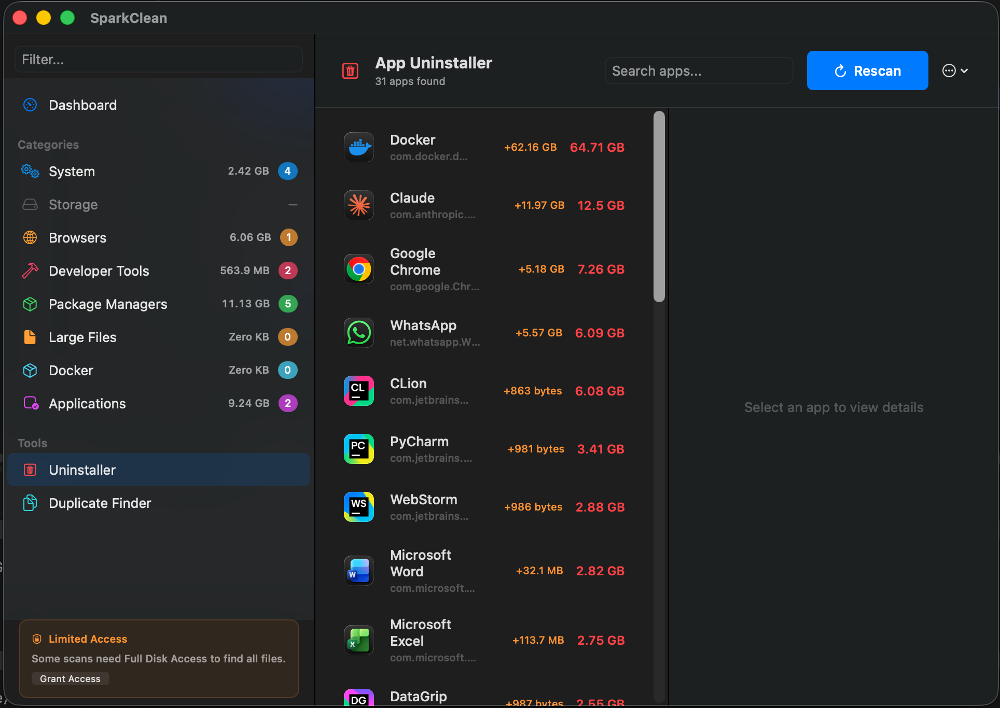

# SparkClean v1.0.0

**Your Mac is hoarding junk. SparkClean finds it and takes out the trash.**

SparkClean is a free, open-source macOS app built with developers in mind. If you work with Docker, Xcode, Node.js, Ollama, JetBrains, Homebrew, or any other dev tools, you know how fast your disk fills up with stuff you didn't even know was there. Dangling Docker images, forgotten Ollama models, abandoned `node_modules`, Xcode DerivedData from three projects ago, stale CocoaPods caches... it adds up fast.

SparkClean scans your system and shows you exactly what's eating your disk space, so you can take it back.

It also covers system caches, old downloads, browser data, duplicate files, and leftover app data.

Built with SwiftUI. No subscriptions. No telemetry.

## Screenshots

### Dashboard

<p>
  
</p>

### Duplicate Finder

<p>
  
</p>

### App Uninstaller

<p>
  
</p>

## Download

Download the latest DMG from [GitHub Releases](https://github.com/georgekhananaev/spark-clean/releases).

Drag it to Applications and you're done.

## Built for Developers

SparkClean pays special attention to the kind of junk that piles up on a developer's machine:

- **Docker** - Unused images, stopped containers, dangling volumes, and build cache. Like `docker system prune`, but with a UI so you can see what you're deleting.
- **Xcode** - DerivedData, archives, old simulators, and device support files.
- **Node.js** - Forgotten `node_modules` folders scattered across your projects.
- **Ollama** - Downloaded models you're no longer using.
- **JetBrains** - Caches, logs, and local history from IntelliJ, WebStorm, PyCharm, and others.
- **Homebrew** - Old package versions and stale cache files.
- **Package Managers** - CocoaPods, Composer, pip, and other package manager caches.

## What Else It Does

- **Deep Scan** - Goes through caches, temp files, logs, browser data, and more.

- **Smart Categories** - Sorts everything into groups: System, Storage, Browsers, Developer Tools, Package Managers, Docker, and Applications.

- **Safety Levels** - Every category is labeled **Safe**, **Review**, or **Caution** so you know what's safe to delete before you delete it.

- **App Uninstaller** - Finds all the leftover data from uninstalled apps: preferences, caches, containers, login items, and more.

- **Duplicate Finder** - Three-pass verification: file size, header comparison, then SHA-256 hash. No false positives.

- **Large File Hunter** - Finds large files you may have forgotten about.

- **Per-File Selection** - Pick and choose exactly which files to remove. Full control over what gets deleted.

- **Disk Usage Overview** - Visual breakdown of your disk space with reclaimable space highlighted.

- **Export Reports** - Generate summary or detailed audit reports of scan results.

- **Configurable Thresholds** - Adjust what counts as "old," "large," or "unused."

## How Cleanup Works

SparkClean moves files to the Trash by default. Nothing gets permanently deleted right away, so you can always recover something if needed. You'll need to empty the Trash yourself when you're ready.

The exceptions are Docker and Ollama. Docker containers, images, and volumes are removed using Docker's own CLI commands, and Ollama models are deleted through the Ollama CLI. These are removed natively, the same way you'd do it from the terminal.

## Full Disk Access

SparkClean needs Full Disk Access to scan folders that macOS restricts by default (Mail, Messages, app containers, etc.). Without it, some categories won't return results. You can grant it in **System Settings > Privacy & Security > Full Disk Access**.

## Privacy

SparkClean runs entirely on your machine. There are no servers, no accounts, no analytics, and no network requests. Nothing leaves your computer. The app doesn't collect, store, or transmit any data about you or your files. Your scan results stay local and are never shared with anyone. The source code is open so you can verify all of this yourself.

## Requirements

- macOS 14.0+
- Xcode 16.0+ (for building from source)

## Build From Source

```bash
git clone https://github.com/georgekhananaev/spark-clean.git
cd spark-clean
open SparkClean.xcodeproj
```

Hit **Cmd+R** in Xcode. No CocoaPods, no SPM dependencies. Just pure Swift.

Or from the terminal:

```bash
xcodebuild -project SparkClean.xcodeproj -scheme SparkClean -configuration Release build
```

## License

See [LICENSE](LICENSE) for the full terms.

## Author

**George Khananaev**

## Supported Devices

See [SUPPORTED.md](SUPPORTED.md) for tested devices, OS versions, and compatibility info.

## Changelog

See [CHANGELOG.md](CHANGELOG.md) for a detailed history of changes.
